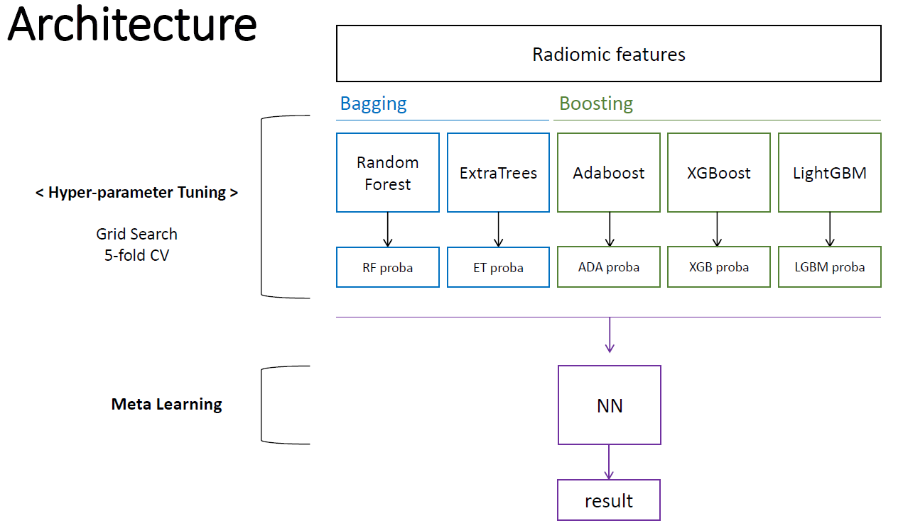

# AI HeLP Contest 2-1. Stroke onset time classification
This repository contains scripts for our solution to [HeLP Challenge 2018](https://www.synapse.org/#!Synapse:syn15569329/wiki/582412). Goal of the competition was to create an algorithm to determine symptom onset time for acute ischemic stroke.

 

## Data Description
Data collection from Asan Medical Center was provided as the training, validation, and testing data. The size of dataset is as follows.

| Dataset | Positive | Negative | Total |
| :-------: | :-------: | :-------: | :-------: |
| **Train** | 123 | 132 | 255 |
| **Validation** | 26 | 18 | 44 |
| **Test** | 33 | 23 | 56 |

 

## Model Overview
We extracted features from combination of sequence and mask. Based on extracted features, we used stacked ensemble model.

 
 

 

## Training Methods
### Pre-processing
- Voxel size resampling : Resampling voxel size to (0.65, 0.65, 3) collectively
- Normalization : Lesion-based Normalization (Entire sequence was devided by the mean value of pixels surrounding lesion region)

### Model
- Hyperparameters (by Cross Validation)

  i.	Random Forest
  (1) max_depth : 6
  (2) n_estimators : 300
  (3) min_samples_leaf : 20

  ii.	Weight initialization
  (1) max_depth : 5
  (2) n_estimators : 10
  
  iii.	AdaBoost
  (1) algorithm : SAMME.R
  (2) learning_rate : 0.01
  (3) n_estimators : 300

  iv.	XGBoost
  (1) max_depth : 8
  (2) colsample_bytree : 1.0
  (3) gamma : 2.5
  (4) subsample :0.6
  (5) learning_rate : 0.1
  (6) n_estimators : 500
  (7) min_child_weight : 1

  v.	LightGBM
  (1) subsample : 0.6
  (2) colsample_bytree : 1.0
  (3) reg_alpha : 5.0
  (4) reg_lambda : 2.0
  (5) learning_rate : 0.1
  (6) n_estimators : 100
  (7) min_child_weight : 5

 

## Results
Our score for test dataset is as follows

| F0.5 Score | Accuracy | AUC |
| :-------: | :-------: | :-------: |
| 0.7718 | 0.7142 | 0.7437 |
