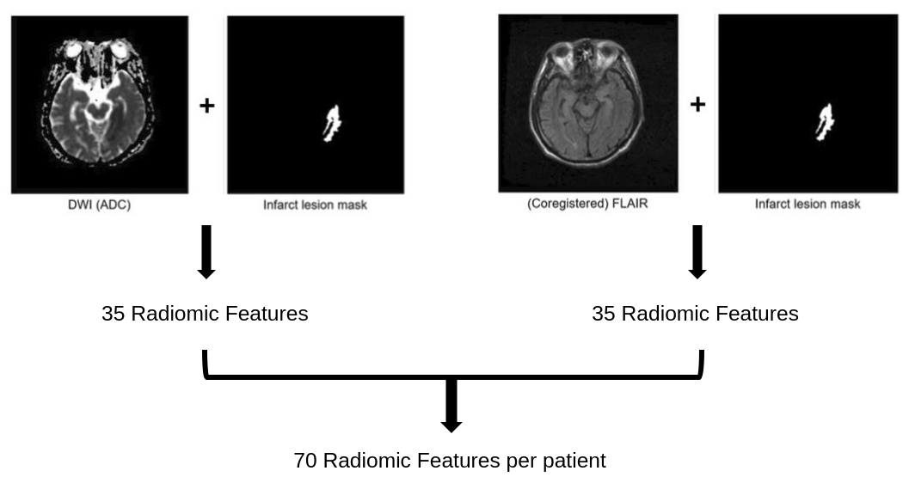

# AI HeLP Contest 2-1. Stroke onset time classification
This repository contains scripts for our solution to [HeLP Challenge 2018](https://www.synapse.org/#!Synapse:syn15569329/wiki/582412). Goal of the competition was to create an algorithm to determine symptom onset time for acute ischemic stroke.

 

## Data Description
Data collection from Asan Medical Center was provided as the training, validation, and testing data. The size of dataset is as follows.

| Dataset | Positive | Negative | Total |
| :-------: | :-------: | :-------: | :-------: |
| **Train** | 123 | 132 | 255 |
| **Validation** | 26 | 18 | 44 |
| **Test** | 33 | 23 | 56 |

 

## Model Overview
We extracted features from combination of sequence and mask. Based on extracted features, we used stacked ensemble model.

 

## Training Methods
### Pre-processing
- Voxel size resampling : Resampling voxel size to (0.65, 0.65, 3) collectively
- Normalization : Lesion-based Normalization (Entire sequence was devided by the mean value of pixels surrounding lesion region)

### Model
- Hyperparameters

 

## Results
Our score for test dataset is as follows

| F0.5 Score | Accuracy | AUC |
| :-------: | :-------: | :-------: |
| 0.7718 | 0.7142 | 0.7437 |
